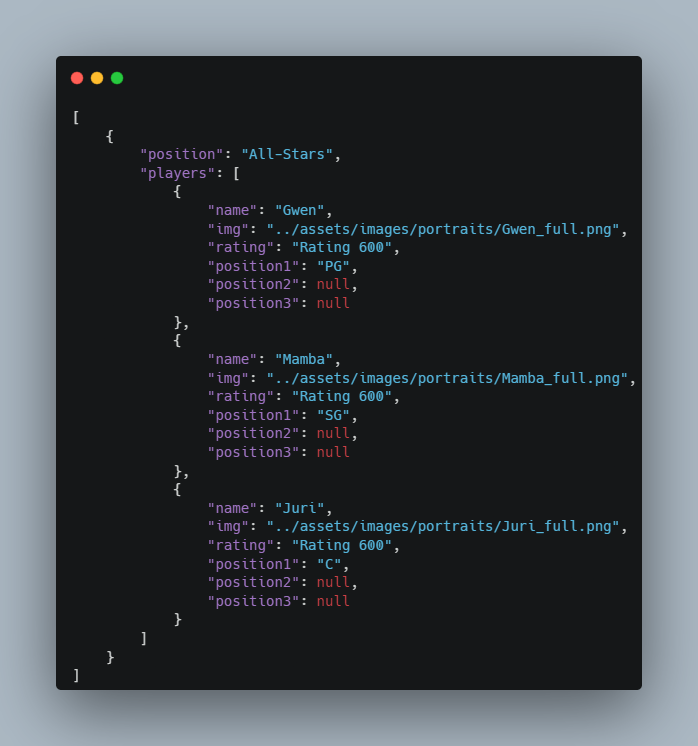

# `ContactFail - 热血街篮 Viewer`
This project was created for some brief React and frontend/vanilla css practice; the premise is it allows American and Southeast Asian users to view Basketrio Content 3-6 months early, and in reasonably detail without having to login to the game.
(Considering adding admin panel for easier community maintenance in the future.)

<a href="https://contactfail.como">ContactFail.com/</a> or via pages at <a href="https://alienfunbug.github.io/ketrio">https://alienfunbug.github.io/ketrio/</a> shows a live view of the site.

### `Creation process for importing new characters`
This resource was originally designed to be taken over by the community; to update the content please see the following steps:

- Add the following character details info into 'src\data\characterData\characters.json':
- name/fate/position/featureName/featureDescription/stats/passive/eliteSkill_file_name
- highlights(youtube tag link)

    
- Add character info to 'src\data\characterData\characterpositions.json'
- Add character ranking image to 'public\assets\images\ranking_images' in format: ranking_large_name.png (aim for 4:5 aspect ratio or 800x900 / 710x800 pixels)
- Add character recruitment image to folder 'public\assets\images\portraits' in format: Name_full.png -- (aim for 4:5 aspect ratio or 800x900 / 710x800 pixels)
- Add character eliteSkill image to  folder 'public\assets\images\char_elite_skills' in format: name_position_elite_skills.png(ratio and size doesnt matter much)

## `(OPTIONAL) Updating Main/Landing Page`

- 'pages\LandingPage.js' is static and doesnt need to be updated directly:
    - update respective weekly video gif in 'public\assets\videos\landing_page' weekly.gif file 
    - to update the weekly video LINK, update line 10 on 'src\pages\WeeklyVideoPage.js'
    - update respective main image and meta image in 'public\assets\images\landing_page' lead_char.png file 
    
### `More to be added later`

- This was a quick project that was only intended to be maintained and used for a few months, but it spiralled out of control as it became a community dependency! 
- I was extremely greatful for the opportunity to help,and was extremely glad the project was so well received by All9Fun / CubeMagic.
